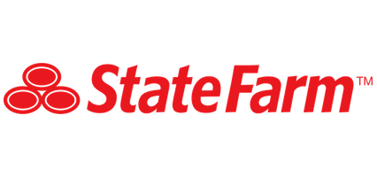

#StateFarm competition

 

# Instructions

## Dependencies

**To manage the environment:**
python-dotenv

**General:**
pandas numpy scipy matplotlib h5py

**For parallell processing:**
parmap

**For machine learning:**
keras, lasagne scikit-learn, theano

**For image manipulation**
opencv3, scikit image, pillow

## Project organisation

    
    ├── README.md          <- The top-level README for developers using this project.
    ├── data
    │   ├── external       <- Data from third party sources.
    │   ├── processed      <- The final, canonical data sets for modeling.
    │   └── raw            <- The original, immutable data dump.
    │
    ├── models             <- Trained and serialized models, model predictions, or model summaries
    │
    ├── reports            <- Generated analysis and submissions
    │   └── figures        <- Generated graphics and figures to be used in
        └── submissions    <- Generated kaggle submissions
    │
    ├── src                <- Source code for use in this project.
    │   ├── data           <- Scripts to download or generate data
    │   │   └── make_dataset.py
    │   │
    │   ├── utils       <- Scripts with various utility functions
    │   │
    │   ├── model         <- Scripts to train models and then use trained 

## Setup

**Data**

- Download data from Kaggle, unzip and put it in data/raw
- You should then have a train folder, a test folder and the file listing the drivers `driver_imgs_list.csv`

**Pre-trained models**

Download the following:

- [VGG16](https://gist.github.com/baraldilorenzo/07d7802847aaad0a35d3)
- [VGG19](https://gist.github.com/baraldilorenzo/8d096f48a1be4a2d660d)
- [resnet50](https://github.com/Lasagne/Recipes/tree/master/examples/resnet50)

and put it in data/external

**ENV**

in the projects root directory, create a .env file as follows

    PROJ_DIR=/absolute/path/to/project/
    RAW_DIR=/absolute/path/to/project/data/raw/
    DATA_DIR=/absolute/path/to/project/data/processed/
    FIG_DIR=/absolute/path/to/project/reports/figures/
    MODEL_DIR=/absolute/path/to/project/models/
    EXTERNAL_DIR=/absolute/path/to/project/data/external/

## Create the dataset

Go to `/src/data` and then call 

    python make_dataset.py

This will create an HDF5 dataset in `data/processed` for the train and test set. The original images are resize to (224,224,3) and the train data is split into 8 cross validation folds.

N.B. This script uses `parmap` for multiprocessing.
N.B. You can specify a file (same format as a Kaggle submission file) so that the test dataset is built with soft targets (cf. G. Hinton Dark Knowledge)

## Train a model

To train a `keras` model:

Go to `/src/model` and then call

    python main_keras.py

This will train 8 models (on 8 cross-validation folds), save an experiment log in `/models/model_name/Experiment_XX`, save the weights of the model with lowest loss on the held out folds and then make predictions on the test set.

This script can be modified to choose:

- The model type (VGG16, VGG19, VGGCAM, simple CNN)
- The pretrained weights
- Whether or not to use semi-supervised learning
- The usual hyperparameters (epochs, batch size ...)

To train a `lasagne resnet50` model, call:

    python main_lasagne.py

the script can be modified as above.

## Ensembling predictions

Did not have much success with stacking or test time augmentation. Best results were obtained through simple averaging (mean or geometric).

To combine the predictions from several previous submissions, call

    python merge_submission.py

